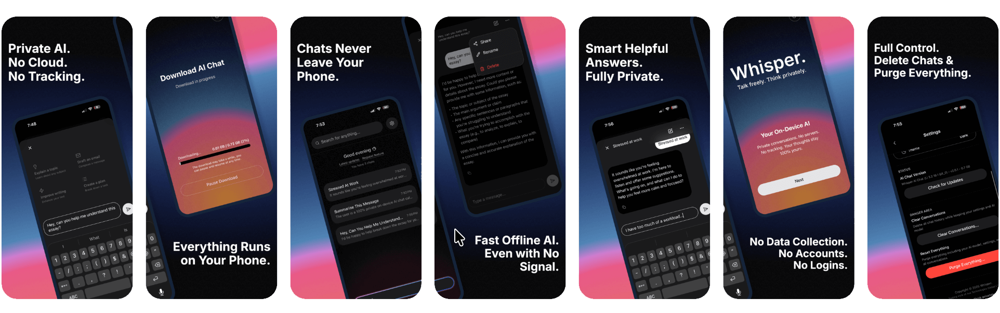

# Whisper AI App

[Whisper AI](https://usewhisper.org), The 100% private AI Chat App.

## Download the App

&nbsp;&nbsp;

- iOS / Apple - download on the [App Store](https://apps.apple.com/us/app/whisper-ai/id6754563737)

- Android - get it on [Google Play](https://play.google.com/store/apps/details?id=org.avatechnologies.whisper)

## Community

We're building Whisper as an open App and would love your help! Whether you're interested in suggesting ideas, contributing code, documentation, design, or just being part of our community, there are several ways to get involved.

Our community is on Discord - [join now.](https://discord.gg/A6JxByaKNX)

**Want to contribute ideas & discuss the app?**
- [Join our Discord](https://discord.gg/A6JxByaKNX) to connect with other users, ask questions, and share ideas
- Head to our [GitHub Issues](https://github.com/Whisper-AI-App/app/issues) or [Discussions](https://github.com/Whisper-AI-App/app/discussions) to join conversations

**Want to contribute code?**
- Read our [CONTRIBUTING.md](./CONTRIBUTING.md) guide for development setup, coding standards, and how to submit changes

All contributions are welcome!
